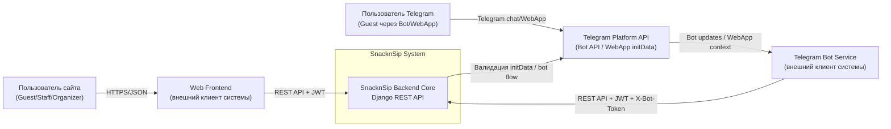
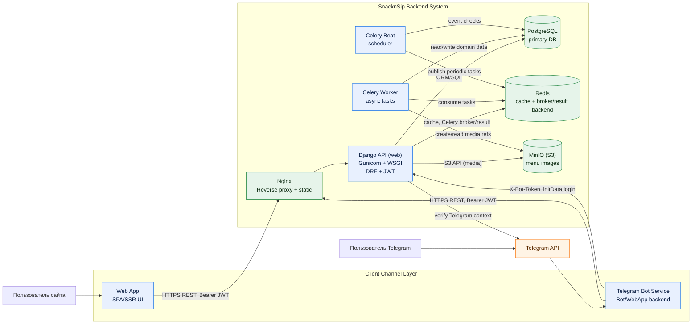
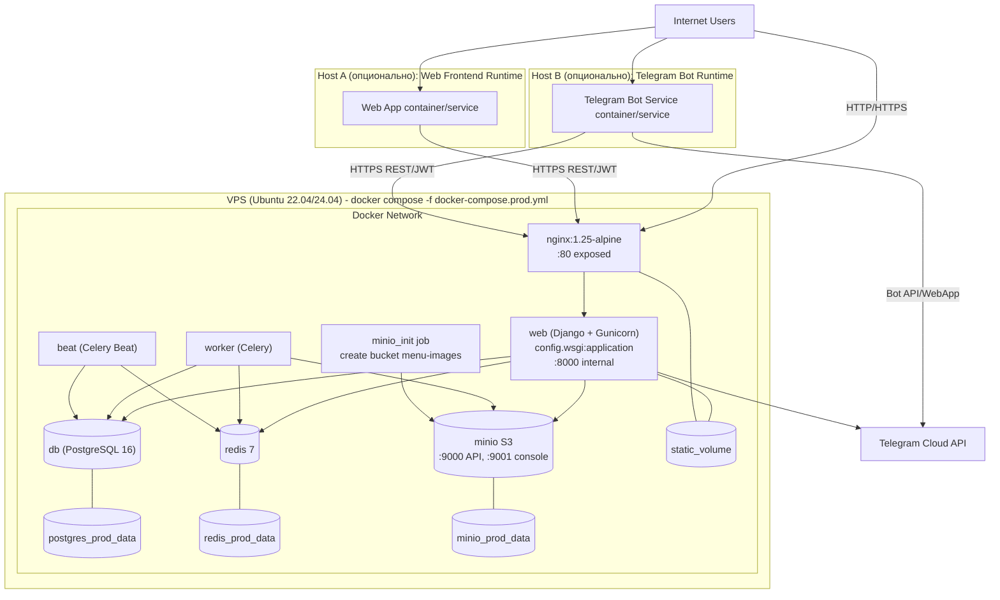

# SnacknSip Architecture

Документ фиксирует целевую архитектуру системы SnacknSip, где Django API является ядром и обслуживает два независимых канала: Web Frontend и Telegram Bot.

## 0) Scope и допущения

- Источники: `README.md`, `task/API.md`, `task/DEPLOYMENT.md`, `docker-compose.prod.yml`, `src/config/settings/base.py`, `src/apps/api/views/auth.py`.
- В проде backend запускается в Docker Compose: `nginx`, `web` (Gunicorn + Django WSGI), `worker`, `beat`, `db`, `redis`, `minio`, `minio_init`.
- `Web App` и `Telegram Bot Service` логически отдельные контейнеры приложения и могут деплоиться независимо от backend-стека.
- S3-совместимое хранилище реализовано через `MinIO` на нашем сервере (через Docker Compose).

---

## 1) C4 Context Diagram (Level 1)

**Легенда**
- `Пользователь` - человек, взаимодействующий с каналом.
- `Web Frontend` и `Telegram Bot Service` - внешние по отношению к backend системные клиенты.
- `SnacknSip Backend Core` - единая бизнес-логика и API-контракт.
- `Telegram Platform API` - внешняя зависимость для Telegram-сценария.

**Почему такое разделение**
- Каналы Web и Telegram независимы по UX/релизам, но используют единое ядро правил заказа, лимитов и ролей.
- Telegram требует отдельной интеграции (Bot API, WebApp `initData`, `X-Bot-Token`), поэтому вынесен как внешний системный участник.

---

## 2) C4 Container Diagram (Level 2)

**Легенда**
- `app` (синий) - прикладные контейнеры с бизнес-логикой или клиентским каналом.
- `infra` (зеленый) - инфраструктурные контейнеры хранения/сети.
- `ext` (оранжевый) - внешние платформенные зависимости.

**Почему такое разделение**
- `Django API` изолирован как ядро синхронного HTTP API (Gunicorn + WSGI) и доменной логики.
- `Celery Worker/Beat` вынесены отдельно для фоновых/периодических задач (уведомления, авто-закрытие событий, очистка токенов).
- `PostgreSQL`, `Redis`, `MinIO` выделены как независимые stateful сервисы с разным профилем нагрузки и отказоустойчивости.
- `Web App` и `Telegram Bot Service` показаны отдельными контейнерами, т.к. это два независимых клиента одного API.

---

## 3) Deployment Diagram

**Легенда**
- `VPS` - подтвержденный production-контур из `task/DEPLOYMENT.md` и `docker-compose.prod.yml`.
- `Host A/Host B` - независимые рантаймы для Web и Telegram каналов (могут быть выделены отдельно для независимого релизного цикла).
- `minio_init` - одноразовый init-job для создания бакета и публичной политики.
- Именованные volumes - постоянное хранение состояния БД/кеша/объектов и статики.

**Почему такое разделение**
- Backend и stateful-сервисы собраны на одном VPS для простого и быстрого запуска.
- Отдельный Nginx фронтирует Django-контейнер и раздает статику.
- Клиентские каналы вынесены в отдельные deployment-юниты, чтобы не блокировать релизы друг друга и backend.
- MinIO размещен на нашем сервере в том же compose-стеке, как требовалось.

---

## 4) Технологические акценты Django

- Текущий runtime API в проде - **WSGI через Gunicorn** (`config.wsgi:application`).
- Асинхронная обработка - через **Celery Worker + Redis**, планировщик - **Celery Beat**.
- Аутентификация - JWT (`Bearer`) + отдельный Telegram login flow с `X-Bot-Token`.
- API документация - `drf-spectacular` (`/api/docs/`).
- Медиа (изображения меню) - S3 API через MinIO (`storages.backends.s3boto3`).
